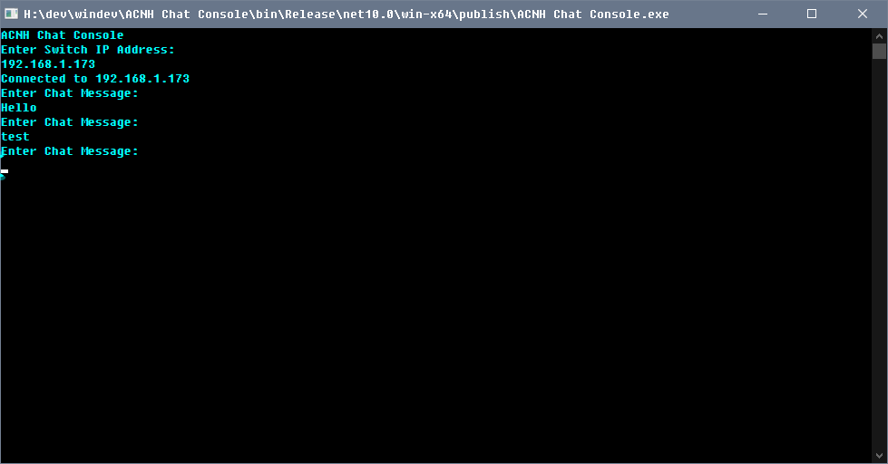

# ACNHPoker Console

## This app is for Windows or Linux.    

## Done:
* Chat part is done.   
* inventory freeze and unfreeze

# TO DO:  
* read inventory (pockets)
* load nhi

## Prerequisite

   1. A Nintendo Switch capable of running unsigned code.
   2. [sys-botbase](https://github.com/olliz0r/sys-botbase) installed on your Switch.
   3. A copy of Animal Crossing™: New Horizons for the Nintendo Switch
   4. windows or linux computer or device   
   
## Installation

   1. Grab windows exe or linux binary from the release page. 
   2. copy the bin to your preffered place on your computer or device. 
   3. chmod +x if needed to. 
   4. run it.  
   
## Usage  
	
1. put in your switch ip address
2. type in whatever you want.  
3. press return
4. again and again for chatting in the game.  

## Credit 
I used some of ACNHPokerCore codes for connection and chat parts. 
Thank you to [MyShiLingStar](https://github.com/MyShiLingStar/ACNHPokerCore)

My fucking brain  

## Screenshot

   
